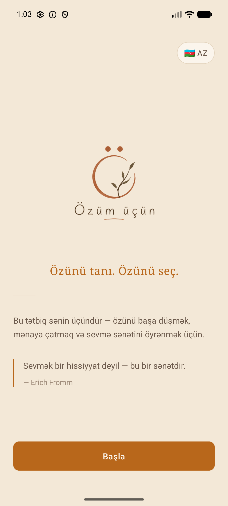
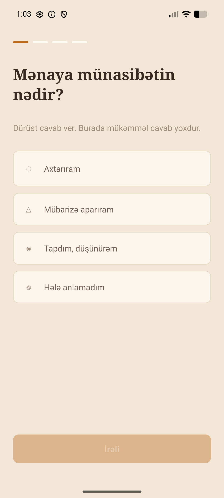

<div align="center">


# Özüm üçün — the art of loving

**A calm, offline self-reflection app for Android, inspired by Erich Fromm's _The Art of Loving_.**

Understand yourself, one honest question at a time — no ads, no accounts, no data collection.

[](./LICENSE)


</div>

---

## About

**Özüm üçün** (Azerbaijani for _"for myself"_) is a philosophical companion for getting to
know yourself — without rushing, and without toxic positivity. It draws on Erich Fromm's idea
that love is not a feeling you fall into, but an art you practice.

The app walks you through **10 guided modules** — care, responsibility, respect, knowledge,
solitude, maturity and more. Each module follows the same rhythm:

> **Concept card** → **Reflection question** → **Daily practice** → **Scenario quiz**

Everything you write stays **only on your device**. There is no server, no sign-up, and no
tracking. The app works fully offline.

## Screenshots

<div align="center">

&nbsp;&nbsp;

</div>

## Features

- 📚 **10 structured modules** — concept → reflection → practice → scenario quiz
- 📝 **Private reflection journal** — stored locally, never leaves the device
- 🎯 **Gamification** — XP, levels, badges, and a growing-heart progress mechanic
- 🔔 **Optional daily reminders** — gentle, inexact local notifications
- 🌍 **Full internationalization** — Azerbaijani, English, Russian
- 🔒 **Privacy-first** — no backend, no accounts, no data collection, works offline
- 🎨 **Custom warm design system** — tokens for color, type, and spacing

## Tech stack

| Area | Choice |
|------|--------|
| Framework | **React Native 0.85** (bare CLI, New Architecture) + **React 19** |
| Language | **TypeScript** |
| Local database | **op-sqlite** — offline-first, zero network |
| State | **Zustand** |
| Navigation | **React Navigation v6** (native-stack + bottom-tabs) |
| Notifications | **Notifee** (local, inexact daily reminders) |
| Animation | **Reanimated 4** + Worklets |
| i18n | **i18next** / react-i18next (3 languages) |
| Graphics | **react-native-svg**, custom bootsplash |

## Architecture highlights

- **Offline-first, backend-free.** All state (journal entries, check-ins, progress, settings)
  lives in a local SQLite database. The app has no server and makes no network calls for user
  data.
- **Thin, testable data layer.** A small adapter wraps op-sqlite with `runAsync` /
  `getFirstAsync` / `getAllAsync` helpers so the rest of the app is storage-agnostic.
- **Typed content model.** All 10 modules and their quizzes are defined as typed data,
  localized into three languages.

## Engineering challenges solved

Building solo meant owning everything from native crashes to store review. A few highlights:

- **Native startup crash → ABI splits.** Tracked a `couldn't find DSO to load:
  libreactnative.so` crash to per-ABI splits being applied to _debug_ builds. Made splits
  release-only so debug ships a single-ABI APK that runs anywhere.
- **SQLite returning empty rows.** After migrating from `expo-sqlite` to `op-sqlite`,
  parameterless `SELECT`s silently returned no rows. Rewrote the adapter to materialize rows
  from `columnNames` + `rawRows` and to skip the params array when empty.
- **Restricted permission cleanup.** A notifications dependency injected
  `USE_EXACT_ALARM` / `SCHEDULE_EXACT_ALARM` via the manifest merger. Since daily reminders
  only need _inexact_ alarms, stripped them with `tools:node="remove"` to avoid a restricted
  Play permission and pass review.
- **Full Play release pipeline.** Upload keystore + Play App Signing, signed AAB, Data Safety
  (no collection), content rating, and the 12-tester / 14-day closed-testing requirement for
  new personal developer accounts.

## Getting started

```bash
# 1. Install dependencies
npm install

# 2. Start Metro
npm start

# 3. In a second terminal, build & run on a connected device/emulator
npm run android
```

**Prerequisites:** Node 18+, JDK 17, Android SDK, and an Android emulator or device.
Release builds read signing credentials from a gitignored `android/keystore.properties`.

## Privacy

The app collects nothing. Full policy:
**https://ozum-ucun-privacy.netlify.app/**

## License

Released under the [MIT License](./LICENSE) — © 2026 Ramin Nasraddinzade.

## Author

**Ramin Nasraddinzade**
📧 nasraddinzade@gmail.com

> 💼 Open to **React Native / Mobile / Frontend Developer** roles — feel free to reach out.
